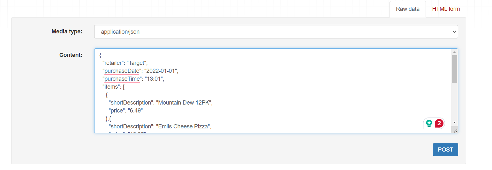

# receipt-processing-challenge
Taking on this challenge to improve Django and Docker skills

1. Run command -> docker-compose up --build

2. Navigate to -> http://localhost:8000/api/receipts/process/

3. Enter receipts in raw format 

    

4. The receipt would be posted in the list

    

5. copy id of the posted receipt and navigate to -> http://localhost:8000/api/receipts/{id}/points/

